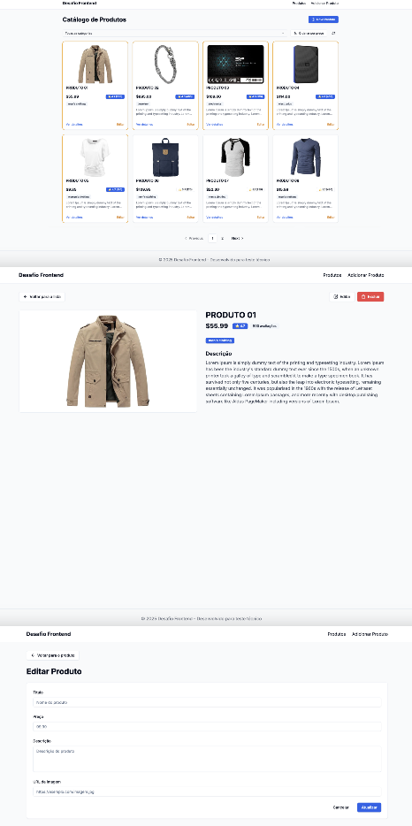

# 🚀 Desafio Front-End

## 📌 Introdução
Este projeto é uma aplicação desenvolvida para o desafio de Front-End, com o objetivo de implementar um CRUD completo de produtos utilizando a API pública [Fake Store API](https://fakestoreapi.com/). O foco está na usabilidade, performance e qualidade do código, seguindo os princípios SOLID e boas práticas de desenvolvimento.

---

---

## 📸 Projeto
<p align="center">
  <a href="https://desafio-frontend-brown-xi.vercel.app/" target="_blank">Acesse o Demo</a>
</p>



---

## 🚀 Como Executar o Projeto

### **1️⃣ Clonar o Repositório**
```bash
git clone https://github.com/seu-usuario/desafio-frontend.git
cd desafio-frontend
```

### **2️⃣ Instalar Dependências**
```bash
npm install
# ou
yarn install
```

### **3️⃣ Executar o Servidor de Desenvolvimento**
```bash
npm run dev
# ou
yarn dev
```
A aplicação estará disponível em **http://localhost:3000**.

### **4️⃣ Executar Testes e Cobertura de Testes**
```bash
npm run test
# ou
yarn test
```

```bash
npm run test:coverage
# ou
yarn test:coverage
```

### **5️⃣ Executar Storybook**
```bash
npm run storybook
# ou
yarn storybook
```
---

## 📩 Contato
Caso tenha dúvidas ou sugestões, entre em contato:
- [LinkedIn](https://linkedin.com/in/lucas-vrod)
- [Github](https://github.com/lucasvrod)

